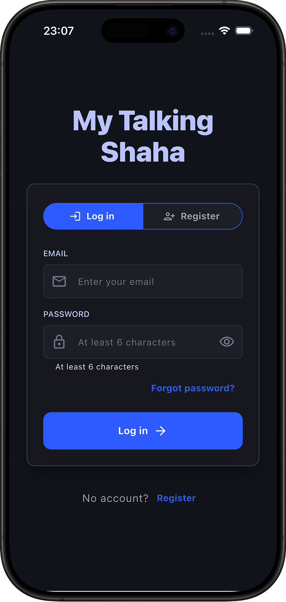
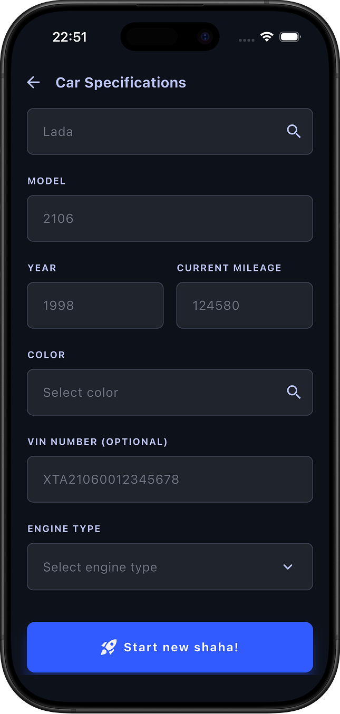
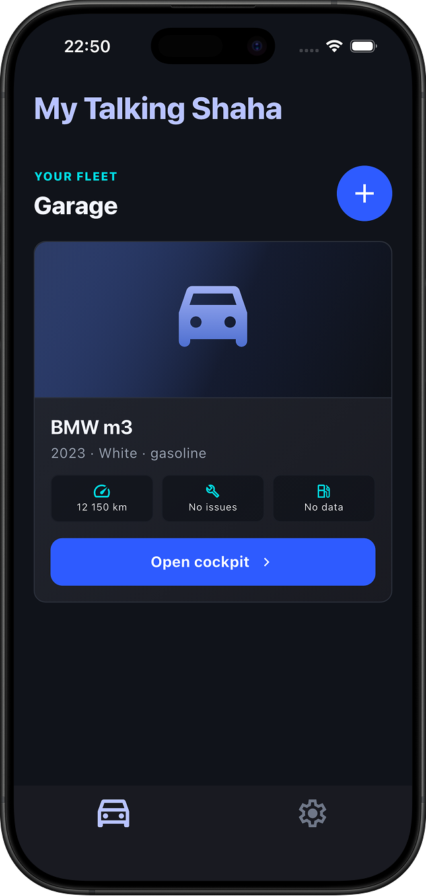
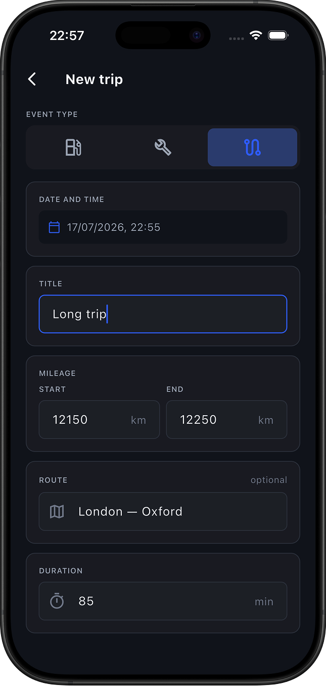
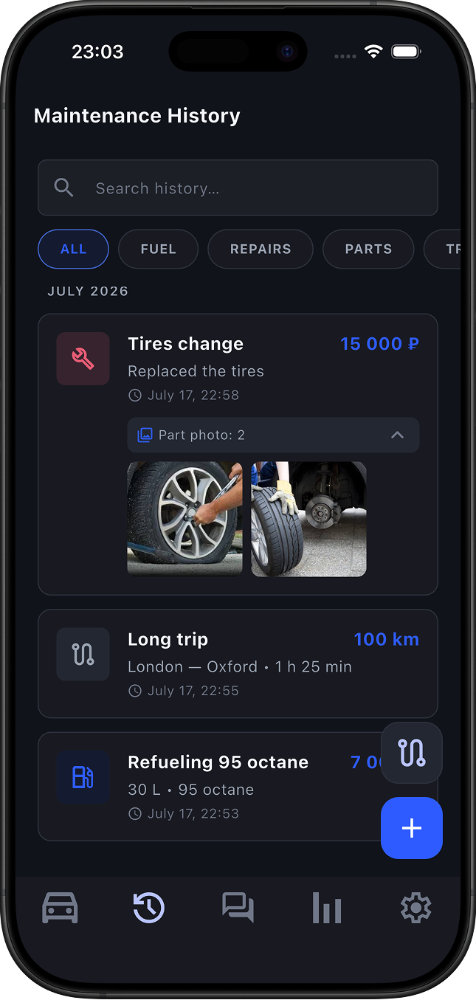
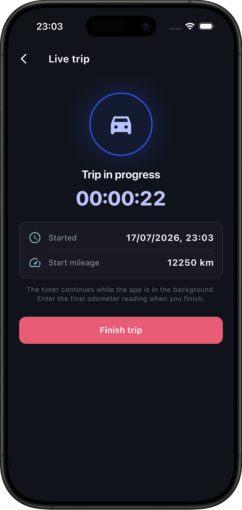
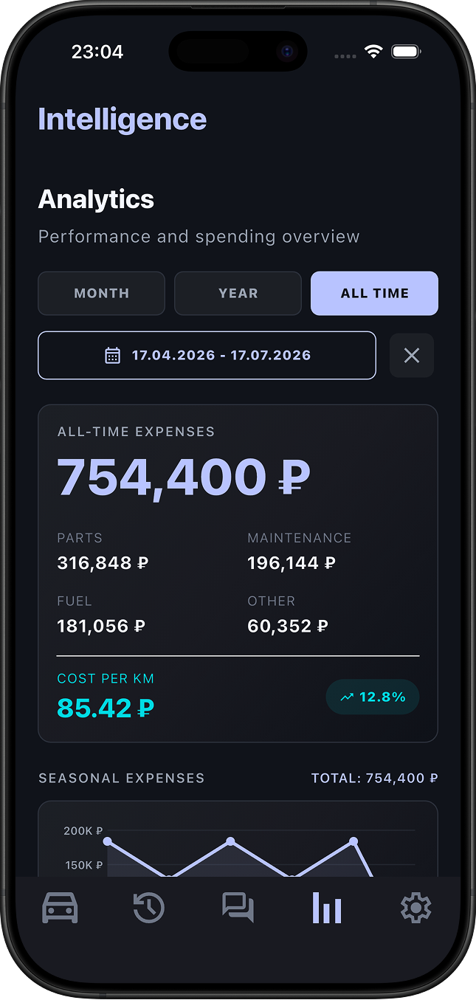
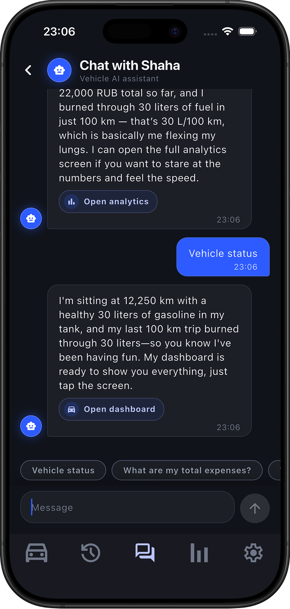
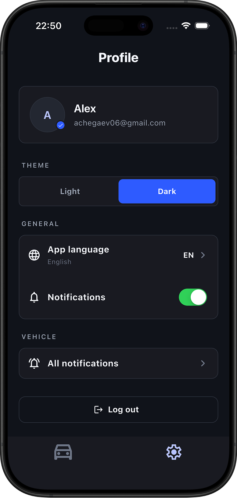

# My Talking Shaha

**My Talking Shaha** is a platform for creating a *digital twin* of your car. It keeps a complete
history of a vehicle — trips, refuels, repairs, and maintenance — and turns that data into
analytics, part-lifetime predictions, and an AI assistant you can simply talk to about your car.

The project is a capstone built by a multi-track team: a **Spring Boot backend**, a **Flutter mobile/web
client**, and a **Python ML service** for maintenance prediction.

---

## Table of contents

- [Project overview](#project-overview)
- [Features](#features)
- [Tech stack](#tech-stack)
- [Repository layout](#repository-layout)
- [Setup instructions](#setup-instructions)
- [Deployment](#deployment)
- [Documentation](#documentation)
- [To be completed](#to-be-completed)

---

## Project overview

Drivers rarely have a single, trustworthy place that answers *"what does my car need, and when?"*
My Talking Shaha builds a digital twin of each vehicle from the data its owner records, then uses that
twin to:

- keep an organized service and usage history;
- show spending, mileage, and maintenance analytics;
- estimate the remaining lifetime of individual parts and warn before they fail;
- answer natural-language questions about the car and guide the user to the right form.

The mobile app talks to the backend as its single source of truth. The backend stores all domain data
and coordinates the AI chat and prediction flows. A dedicated ML service computes component-level
maintenance-need scores.

&nbsp;&nbsp;

<p align="center">
  
  &nbsp;&nbsp;
  
  &nbsp;&nbsp;
  
</p>

<p align="center">
  
  &nbsp;&nbsp;
  
  &nbsp;&nbsp;
  
</p>

<p align="center">
  
  &nbsp;&nbsp;
  
  &nbsp;&nbsp;
  
</p>

## Features

- **Authentication & profile** — email + password registration and login with JWT access/refresh tokens.
- **Garage** — one user, multiple vehicles, each with its own dashboard.
- **History (timeline)** — manual entry of trips, refuels, repairs, and maintenance events, with photos.
- **Parts** — parts list with rule-based remaining-lifetime calculation.
- **Analytics** — aggregated expense, mileage, and maintenance data over custom date ranges.
- **Maintenance prediction** — per-component "maintenance need" score based on mileage, time, and
  vehicle specifications (engine, transmission, weight).
- **AI chat** — answers using the vehicle's own data and can redirect the user to the right form
  (backed by a Timeweb AI / OpenAI-compatible agent).
- **Monitoring** — Prometheus metrics and a provisioned Grafana dashboard with technical and business counters.

> Status: Auth, Garage/Vehicles, Parts, Timeline, and Analytics are implemented. Chat, Prediction,
> and Notifications are partially implemented / described as the target contract. See
> [backend/docs/api-contract.md](backend/docs/api-contract.md).

## Tech stack

**Backend**
- Java 21, Spring Boot (Web, Data JPA, Security/JWT, Actuator)
- Maven, Lombok
- PostgreSQL 16, Flyway migrations
- Local filesystem photo storage behind a storage service
- Micrometer → Prometheus → Grafana

**Frontend**
- Flutter (feature-first architecture: `presentation → domain → data`)
- Targets mobile and web

**ML service**
- Python, FastAPI, Pydantic
- Rule-based component maintenance-need model

**Infrastructure**
- Docker & Docker Compose (Nginx router, blue-green runtime)
- GitHub Actions CI/CD with autodeploy to a development server
- Images published to GitHub Container Registry (GHCR)

## Repository layout

```text
my-talking-shaha/
  backend/     Spring Boot backend (auth, vehicle, timeline, part, analytics, chat, prediction)
  frontend/    Flutter client (mobile + web)
  ml/          FastAPI maintenance-prediction service
  docker/      Dockerfiles, compose files, Nginx router, Prometheus/Grafana config
  docs/        Project docs: deployment, user stories, monetization
  cars/        Car specification datasets (CSV)
```

## Setup instructions

### Prerequisites

- Docker and Docker Compose
- (For running services individually) JDK 21 + Maven, Flutter SDK, Python 3.11+

### Run the whole stack with Docker (recommended)

1. Copy the environment template and fill in real values:

   ```bash
   cp .env.example .env
   # set JWT_SECRET (>= 32 random bytes), DB_USERNAME, DB_PASSWORD, TIMEWEB_AI_TOKEN, ...
   ```

2. Build and start everything:

   ```bash
   docker compose --env-file .env -f docker/docker-compose.yml up --build
   ```

3. Open the app at **http://localhost**.

| Service       | URL                              | Notes                          |
| ------------- | -------------------------------- | ------------------------------ |
| Frontend      | http://localhost                 | via Nginx router               |
| Backend API   | http://localhost:8080            | bound to localhost only        |
| Health        | http://localhost/health          |                                |
| Swagger UI    | http://localhost:8080/swagger-ui.html | generated OpenAPI          |
| Prometheus    | http://localhost:9090            | internal monitoring            |
| Grafana       | http://localhost:3000            | default `admin` / `admin`      |

Stop the stack with:

```bash
docker compose --env-file .env -f docker/docker-compose.yml down
```

See [docker/README.md](docker/README.md) for background mode, logs, and image overrides.

### Run the backend on its own

```bash
cd backend
./mvnw spring-boot:run
```

The backend uses `ddl-auto=validate`; the schema is created and evolved by Flyway migrations, and
database/JWT settings come from environment variables.

### Run the frontend on its own

```bash
cd frontend
flutter pub get
flutter run          # mobile
# or: flutter run -d chrome   # web
```

### Run the ML service on its own

```bash
cd ml
pip install -r requirements.txt
uvicorn ml.api:app --reload
```

## Deployment

Deployment is fully automated. On every push to `main`, GitHub Actions:

1. builds and smoke-tests the Docker stack,
2. publishes backend and frontend images (tagged with the commit SHA) to public GHCR,
3. performs a **blue-green** deploy to the development server over SSH, verifying the inactive slot
   before switching the Nginx router and rolling back automatically if a post-switch check fails.

After deployment the web app is served at `http://135.106.161.10/`, with Swagger UI at
`http://135.106.161.10/swagger-ui.html` and the OpenAPI JSON at `http://135.106.161.10/v3/api-docs`.
Full procedure: [docs/deploy.md](docs/deploy.md).

## Documentation

- Backend: [backend/docs/README.md](backend/docs/README.md) — architecture, API contract, monitoring, prediction.
- Frontend: [frontend/README.md](frontend/README.md)
- ML rules: [ml/RULES.md](ml/RULES.md)
- Deployment: [docs/deploy.md](docs/deploy.md)
- Docker: [docker/README.md](docker/README.md)
- User stories & monetization: [docs/](docs/)

## Team and contribution 

Our track: startup

| Member | Email | Assigned role | Github |
|---|---|---|---|
| Adeliya Nagimova | ad.nagimova@innopolis.university | Team-lead, backend developer | nalemian |
| Arsen Latipov | a.latipov@innopolis.university | Mobile developer, designer | Ars5njo |
| Potapova Daria | d.potapova@innopolis.university | Analyst, project manager | dariapotapova |
| Bikmetov Timur | t.bikmetov@innopolis.university | Backend developer | Tulup-404 |
| Chegaev Alexey | a.chegaev@innopolis.university | Mobile developer | wyroxx |
| Shchekin Arsenii | a.shchekin@innopolis.university | ML-engineer | ARCshekin |
| Mikhail Akhmarov | m.akhmarov@innopolis.university | DevOps | etern1ty22 |
