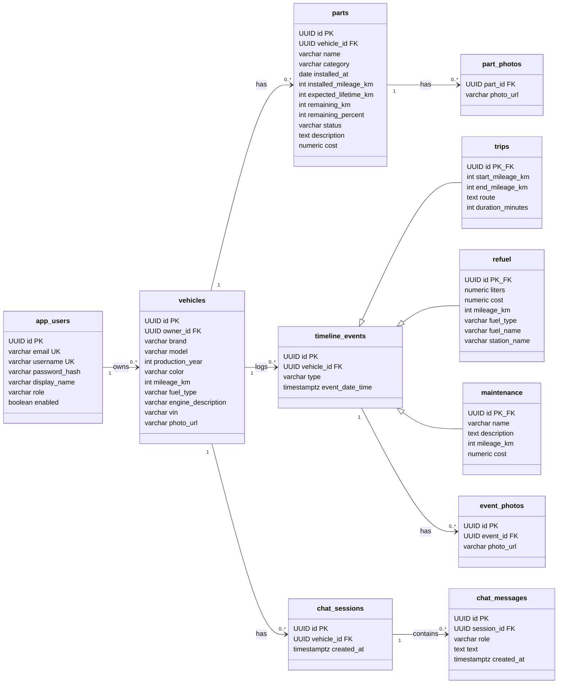

## Database schema

## Description

The schema is centred on **`vehicles`**: a `user` owns many vehicles, and everything else
hangs off a vehicle  its installed `parts`, its service-history `timeline_events`, and its
`chat_sessions`. Photos (`part_photos`, `event_photos`) and `chat_messages` are child
collections of their owner.

Service-history events use **JOINED inheritance**: the shared fields (`vehicle_id`, `type`,
`event_date_time`) live in `timeline_events`, while each concrete kind - `trips`, `refuel`,
`maintenance` - keeps its own columns in a separate table whose `id` is both the primary key
and a foreign key back to the parent (`PK_FK`). One logical event is therefore stored as two
rows sharing the same `id`.

**Notation.** `A <|-- B` - B *is a* kind of A (inheritance). `A "1" --> "0..*" B` - a
foreign key: one A is referenced by many B. `PK` primary key, `FK` foreign key, `UK` unique,
`PK_FK` both at once.
